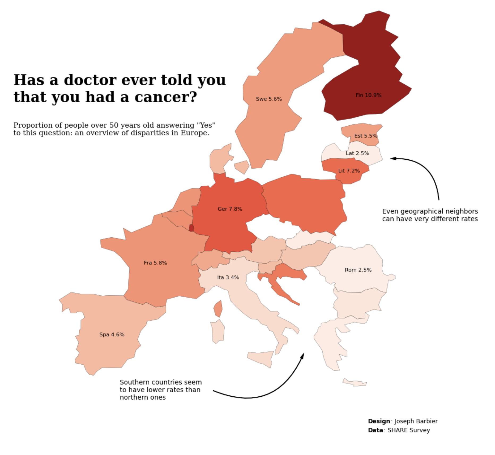
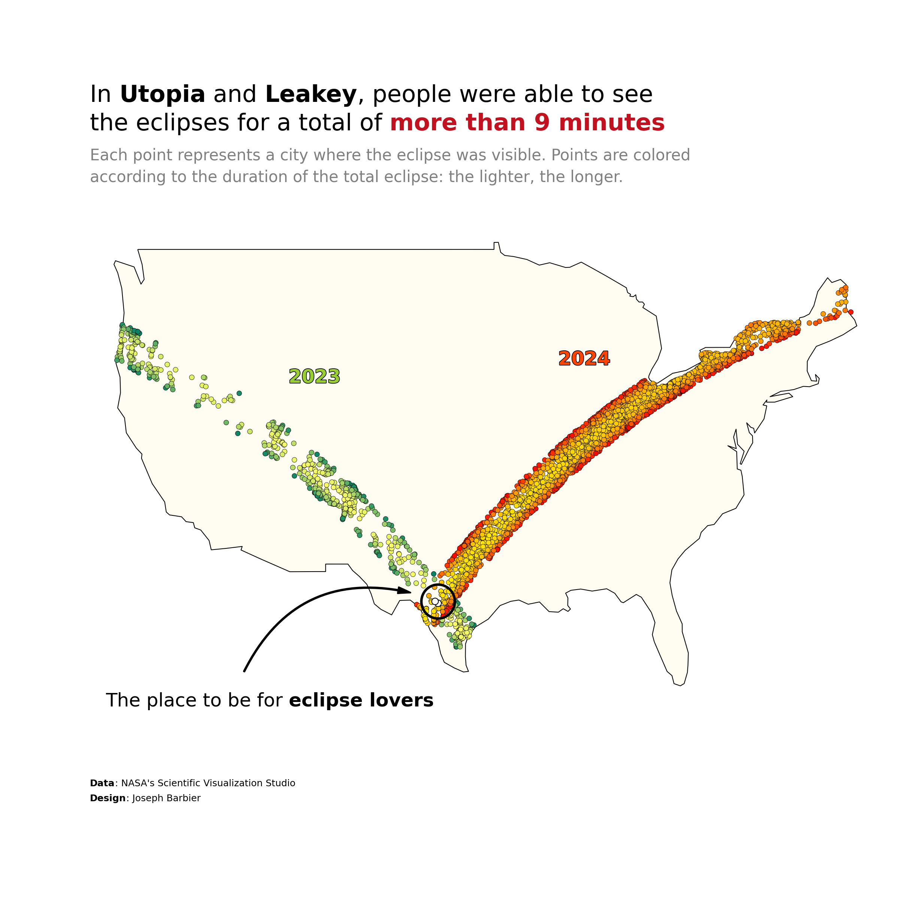
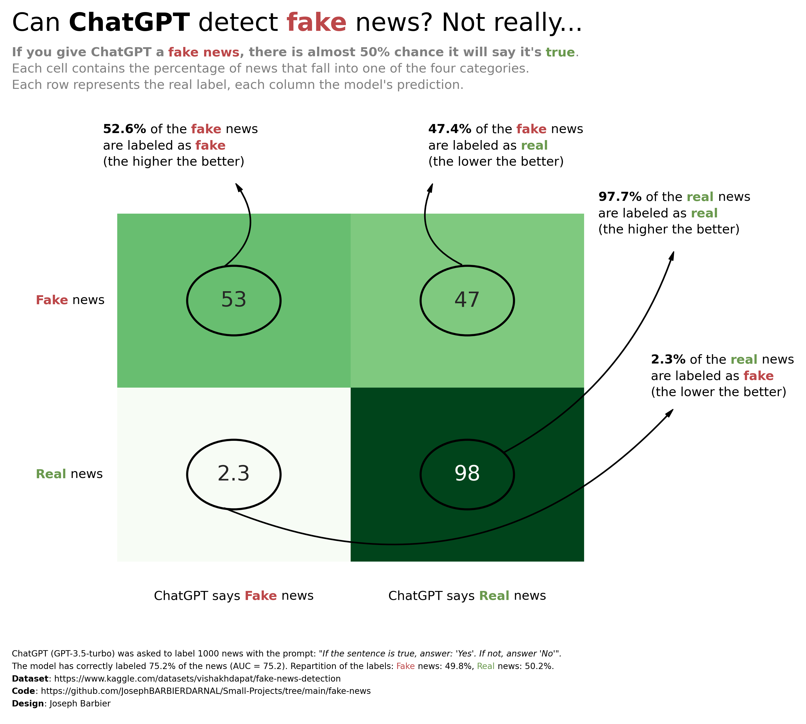
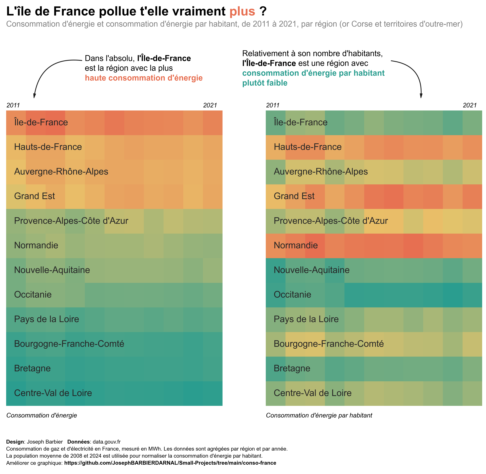

<h2 align="center">Joseph Barbier</h2>

#### Hi 👋 I'm a data, science and open source passionate! Currently working as a **data science/viz/software intern** with [Yan Holtz](https://www.yan-holtz.com) on various projects.

 

- Website: **[www.barbierjoseph.com](https://www.barbierjoseph.com)**
- Reach me: **joseph.barbierdarnal@gmail.com** 

 

  

 

## Visualization

  
  

  
  
  

