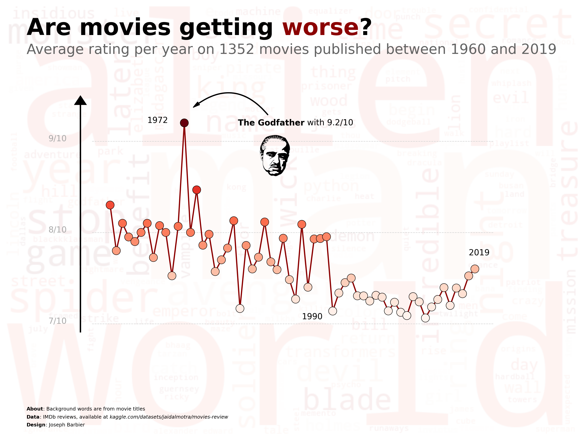
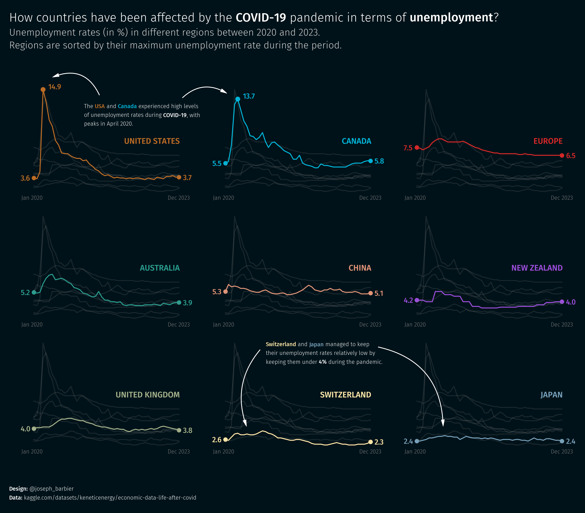

<h2 align="center">Joseph Barbier</h2>

#### Hi 👋 I'm a data, science and open source passionate! Currently working as a **data science/viz/software intern** with [Yan Holtz](https://www.yan-holtz.com) on various projects.

 

- Website: **[www.barbierjoseph.com](https://www.barbierjoseph.com)**
- Reach me: **joseph.barbierdarnal@gmail.com** 

 

 

## Visualization

I spend a lot of time creating visualisations, mainly with matplotlib. Here are a few examples (all my viz are on [my website](https://barbierjoseph.com/#/visualization)):

  

 

  

  
  

